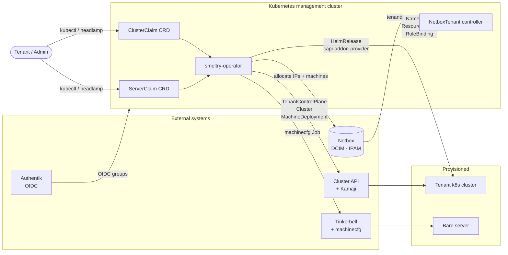

# smeltry-operator

[](LICENSE)
[](https://goreportcard.com/report/github.com/smeltry-io/smeltry-operator)


**smeltry-operator** is a Kubernetes operator that turns bare metal into ready-to-use infrastructure on demand. It exposes a self-service portal via Kubernetes CRDs: tenants request clusters or bare servers, and the operator drives the full provisioning lifecycle — from Netbox IPAM reservation to addon deployment.

> Part of the [Smeltry](https://smeltry.io) project.  
> **Status: early development — not production-ready.**

---

## Overview



The operator implements a sequential, idempotent state machine for each `ClusterClaim`:

```
Pending → Provisioning → ClusterReady → AddonsReady → Ready
                ↓
             Failed
```

| Phase | What happens |
|---|---|
| `Pending` | Admission validation (AddonProfile, SiteConfig, machine availability) |
| `Provisioning` | Netbox IPAM reservation · machine allocation · machinecfg Job · CAPI objects |
| `ClusterReady` | Control plane endpoint up (Kamaji `TenantControlPlane` ready) |
| `AddonsReady` | Required HelmReleases ready (Cilium, Ingress, Rook-Ceph…) |
| `Ready` | Kubeconfig secret exposed to tenant RBAC |

---

## Components

| Component | Description |
|---|---|
| `ClusterClaimReconciler` | Full cluster lifecycle: IPAM → Tinkerbell → CAPI → addons → RBAC |
| `NetboxTenantReconciler` | Polls Netbox tenants; creates/updates Namespace, ResourceQuota, RoleBinding |
| `ConfigReconciler` | Hot-reloads Netbox client when ConfigMap or Secret changes (no restart needed) |

---

## CRDs

### `ClusterClaim` (`portal.smeltry.io/v1alpha1`)

Requests a Kubernetes cluster for a tenant.

```yaml
apiVersion: portal.smeltry.io/v1alpha1
kind: ClusterClaim
metadata:
  name: ml-training
  namespace: tenant-acme
spec:
  machineClass: gpu-large     # Netbox device model filter
  machineCount: 3
  site: paris-dc1             # references a SiteConfig in portal-system
  addonProfile: gpu-compute   # references an AddonProfile in portal-system
```

### `ServerClaim` (`portal.smeltry.io/v1alpha1`)

Requests a single bare server for a tenant.

```yaml
apiVersion: portal.smeltry.io/v1alpha1
kind: ServerClaim
metadata:
  name: build-01
  namespace: tenant-acme
spec:
  machineClass: standard
  site: paris-dc1
  os: flatcar
```

### `AddonProfile` (namespace `portal-system`, admin-only)

Defines which Helm addons to install on a cluster and in which order.

```yaml
apiVersion: portal.smeltry.io/v1alpha1
kind: AddonProfile
metadata:
  name: gpu-compute
  namespace: portal-system
spec:
  components:
    - name: cilium
      required: true
      order: 1
      helmRef:
        repoURL: https://helm.cilium.io
        chartName: cilium
        chartVersion: "1.16.0"
    - name: rook-ceph
      required: false
      order: 3
      helmRef:
        repoURL: https://charts.rook.io/release
        chartName: rook-ceph
        chartVersion: "1.14.0"
  machineConstraints:
    requiredTags: ["gpu"]
```

### `SiteConfig` (namespace `portal-system`, admin-only)

Describes a physical site: Netbox connectivity, network layout, OIDC, DNS zone.

---

## Prerequisites

| Dependency | Version | Notes |
|---|---|---|
| Kubernetes | ≥ 1.29 | management cluster |
| Cluster API | ≥ 1.8 | + CAPT (Tinkerbell provider) |
| Kamaji | any | `TenantControlPlane` CRD |
| Netbox | ≥ 3.7 | DCIM + IPAM + tenancy |
| Tinkerbell | any | via [machinecfg](https://github.com/smeltry-io/machinecfg) |
| Authentik | any | OIDC provider |
| Cilium | ≥ 1.15 | with L2 announcements enabled |
| capi-addon-provider | any | `addons.stackhpc.com/v1alpha1` |

---

## Getting Started

### Deploy with Kustomize

```bash
# 1. Edit config/manager/configmap.yaml with your Netbox URL
# 2. Edit config/manager/secret.yaml with your Netbox token
kubectl apply -k config/default/
```

### Configure

The operator reads its configuration from a **ConfigMap** and a **Secret** in the same namespace. Both are watched at runtime; changes are applied without restarting the Pod.

**ConfigMap** (`smeltry-operator-config`):

| Key | Description |
|---|---|
| `netbox.url` | Netbox base URL, e.g. `https://netbox.example.com` |
| `otel.endpoint` | OTLP gRPC endpoint for traces (optional, leave empty to disable) |

**Secret** (`smeltry-operator-netbox`):

| Key | Description |
|---|---|
| `netbox.token` | Netbox API token |

### Operator flags

| Flag | Default | Description |
|---|---|---|
| `--config-map` | `smeltry-operator-config` | ConfigMap name |
| `--netbox-secret` | `smeltry-operator-netbox` | Secret name |
| `--log-level` | `info` | `debug\|info\|warn\|error` |
| `--leader-elect` | `true` | Enable leader election |
| `--machinecfg-image` | `ghcr.io/smeltry-io/machinecfg:latest` | machinecfg Job image |
| `--netbox-poll-interval` | `5m` | Tenant polling interval |
| `--metrics-bind-address` | `:8080` | Prometheus `/metrics` endpoint |
| `--health-probe-bind-address` | `:8081` | `/healthz` and `/readyz` endpoints |

---

## Observability

| Signal | Details |
|---|---|
| **Logs** | JSON (stdlib `slog`) to stdout; level configurable via `--log-level` |
| **Metrics** | Prometheus on `:8080/metrics` — standard controller-runtime metrics + `smeltry_clusterclaim_phase_total`, `smeltry_netbox_request_duration_seconds`, `smeltry_netbox_request_errors_total` |
| **Traces** | OpenTelemetry OTLP gRPC (optional); set `otel.endpoint` in ConfigMap to enable |
| **Health** | `/healthz` and `/readyz` on `:8081` |

---

## Development

### Prerequisites

- Go 1.22+
- [Task](https://taskfile.dev) (`brew install go-task`)
- `controller-gen` (installed automatically by `task tools`)

### Common tasks

```bash
task generate    # Regenerate DeepCopy methods
task manifests   # Generate CRD + RBAC YAMLs from kubebuilder markers
task build       # Compile binary
task test        # Run tests with race detector
task install     # Apply CRDs to current cluster
task deploy      # Deploy operator to current cluster (Kustomize)
```

### Project layout

```
api/v1alpha1/          CRD types + DeepCopy
internal/
  config/              NetboxHolder (hot-reload) + ConfigReconciler
  controller/          ClusterClaim, NetboxTenant reconcilers
  metrics/             Custom Prometheus metrics
  netbox/              Minimal Netbox REST client
  telemetry/           OpenTelemetry setup
config/
  crd/                 Generated CRD manifests
  rbac/                ServiceAccount, Role, ClusterRole, bindings
  manager/             Deployment, ConfigMap, Secret, Service
  default/             Kustomize entry point
```

---

## Contributing

Please read [CONTRIBUTING.md](https://github.com/smeltry-io/.github/blob/main/CONTRIBUTING.md) and sign your commits (`git commit -s`) — DCO is enforced on all pull requests.

See [GOVERNANCE.md](https://github.com/smeltry-io/.github/blob/main/GOVERNANCE.md) for the project governance model.

---

## License

Apache License 2.0 — see [LICENSE](LICENSE).

Copyright 2026 The Smeltry Authors.
